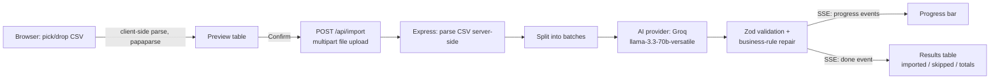

# GrowEasy CSV Importer

An AI-powered CSV importer that takes a lead export in **any** column layout — Facebook Lead Ads, Google Ads, Excel, a real-estate CRM, a hand-built spreadsheet — and maps it into GrowEasy's fixed CRM format, using an LLM to do the field mapping instead of hard-coded column names.

Built for the GrowEasy Software Developer assignment.

**Live demo:** _add your deployed Vercel URL here_
**Backend API:** _add your deployed Render URL here_

---

## How it works

1. **Upload** — drag & drop or pick a `.csv` file.
2. **Preview** — parsed entirely in the browser. Shown in a sticky-header, scrollable table exactly as uploaded. **No AI runs yet.**
3. **Confirm** — only on confirmation does the frontend call the backend.
4. **AI Mapping** — the backend re-parses the file server-side, batches the rows, and sends each batch to an LLM with a schema it must match exactly. Progress streams back live.
5. **Results** — imported records, skipped records (with reasons), and totals, in a second table. Exportable as CSV or JSON.



---

## Key design decisions

A few choices below are as important as the code — they're what the "AI Prompt Engineering" and "edge case handling" parts of this assignment are actually about.

- **Fuzzy work goes to the AI; hard rules are enforced in code.** The prompt (`backend/src/ai/prompts.ts`) asks the model to do the parts that genuinely need judgement — "which column is the name?", "are these two phone numbers?". But the four rules from the spec that have a single correct answer — the `crm_status`/`data_source` enums, the `new Date()`-parseable format, and the skip condition — are **re-checked deterministically** in `validation.service.ts` after the AI responds. This means a malformed value can't reach the response even if a future provider swap loses strict-schema support.
- **Structured output, not "please return JSON."** Groq's OpenAI-compatible API guarantees valid JSON (`json_object` mode); the explicit envelope instruction in the prompt plus Zod validation/retry on every response ensures the schema is enforced even without a native strict-schema API contract — a concrete example of why the deterministic validation layer exists as a second line of defense, not just a formality.
- **Multiple emails/phones → first one wins, rest go to `crm_note`.** Per the spec. This is instructed in the prompt rather than post-processed, since by the time a batch response has a single `email` string, there's nothing left downstream to "merge" — the consolidation has to happen where the raw multi-value text is still visible.
- **`created_at` is rewritten to strict ISO, not just trusted.** GrowEasy's own sample data (`"2026-05-13 14:20:48"`, a space instead of `T`) parses in some JS engines but isn't part of the ISO 8601 spec that guarantees it everywhere. `normalizeDate()` rewrites it to `...T...` explicitly rather than relying on engine-specific leniency. Genuinely unparseable dates become `""` — a blank is honest, a fabricated date is not.
- **DD/MM/YYYY, not MM/DD/YYYY.** GrowEasy is India-based and the sample data uses Indian phone/address conventions, so ambiguous numeric dates are read day-first.
- **The skip rule runs after extraction, not instead of it.** A row with no email and no phone still gets every other field extracted normally; it's filtered out by a pure function (`shouldSkip`) afterward. That keeps "should this row exist in the CRM" as a testable business decision, separate from "what does this row contain."
- **The `mock` AI provider is a convenience, not a shortcut.** With `AI_PROVIDER=mock`, the app runs with **zero setup** — no API key needed — using simple regex header-matching so you can see the full pipeline (upload → batch → validate → stream → results) work immediately. It deliberately cannot understand a column literally named `Column1`; that's the point — `samples/messy_manual_sheet.csv` is built specifically to only work with a real model. The deployed version uses `AI_PROVIDER=groq` with `llama-3.3-70b-versatile`.
- **Four real providers, one interface.** `AiProvider` (`backend/src/ai/types.ts`) is a single `extractBatch()` method; `openai.provider.ts`, `anthropic.provider.ts`, `gemini.provider.ts`, and `groq.provider.ts` each implement it, so swapping providers is a one-line env var change, not a code change. This project uses **Groq** (`llama-3.3-70b-versatile`) — free tier, no card required.
- **Cost, concretely:** Groq has a genuinely free, no-card tier for open-weight models (Llama 3.3) served at high speed. Get a key at [console.groq.com](https://console.groq.com/keys).
- **Two independent services, not one.** The Node/Express backend is a real, separately-deployable API (not Next.js API routes) so it can hold a long-lived streaming HTTP connection for progress events, and so "Backend Quality" is judged on an actual backend rather than serverless route handlers.

---

## Tech stack

| Layer | Choice |
|---|---|
| Frontend | Next.js 16 (App Router), TypeScript, Tailwind CSS v4 |
| Backend | Node.js, Express 5, TypeScript |
| AI | Groq (Llama 3.3 70B via `llama-3.3-70b-versatile`) — free tier, no card needed |
| Validation | Zod, on both the AI response shape and business rules |
| Tables | `@tanstack/react-virtual` — virtualized, so a 50,000-row CSV scrolls smoothly |
| Tests | Vitest (backend: batching/validation/CSV/extraction/mock-provider logic; frontend: SSE parsing/CSV export) |
| Infra | Docker (both services), docker-compose for local dev |

---

## Project structure

```
groweasy-csv-importer/
├── backend/
│   ├── src/
│   │   ├── ai/                 # prompts, provider interface, OpenAI/Anthropic/mock providers
│   │   ├── services/           # csv parsing, validation/repair, extraction orchestration
│   │   ├── controllers/        # HTTP <-> service glue, SSE streaming
│   │   ├── routes/ middleware/ utils/
│   │   └── config.ts           # env validation (fails fast on boot, not mid-request)
│   └── tests/                  # vitest
├── frontend/
│   ├── app/                    # layout, page (the 4-step flow)
│   ├── components/             # UploadDropzone, VirtualTable, ResultsTable, ProgressPanel, ...
│   └── lib/                    # csv parsing, streaming API client, types
├── samples/                    # deliberately varied/messy test CSVs (see below)
└── docker-compose.yml
```

---

## Getting started locally

Requires Node.js 18.18+ (tested on Node 22).

```bash
git clone <your-repo-url>
cd groweasy-csv-importer
npm run install:all
npm run dev
```

That's it — `AI_PROVIDER` defaults to `mock`, so this works with no API key. Frontend: `http://localhost:3000`. Backend: `http://localhost:4000`.

To use real AI extraction, copy the env files and fill in a key:

```bash
cp backend/.env.example backend/.env
# edit backend/.env: set AI_PROVIDER=groq and GROQ_API_KEY
```

Get a free Groq API key (no card needed) at [console.groq.com/keys](https://console.groq.com/keys).

**Or with Docker:**

```bash
AI_PROVIDER=groq GROQ_API_KEY=gsk_... docker compose up --build
```

Try it with the sample files in `samples/` — they're intentionally varied:

| File | What it tests |
|---|---|
| `groweasy_sample.csv` | The exact format from the assignment brief |
| `facebook_leads_export.csv` | Different header names/casing, phone numbers with an embedded country code, no explicit status |
| `real_estate_crm_export.csv` | DD-MM-YYYY dates, two phone numbers in one cell, a `possession` column, one row with neither email nor phone (should be skipped) |
| `messy_manual_sheet.csv` | Generic `Column1/Column2/Column3` headers with no naming signal at all — only real AI extraction handles this well |

---

## Environment variables

**`backend/.env`** (see `backend/.env.example`)

| Variable | Default | Notes |
|---|---|---|
| `PORT` | `4000` | |
| `FRONTEND_URL` | `http://localhost:3000,http://localhost:3001` | CORS allow-list — set to your Vercel URL in production |
| `AI_PROVIDER` | `mock` | `mock` \| `openai` \| `anthropic` \| `gemini` \| **`groq`** ← used in production |
| `GROQ_API_KEY` / `GROQ_MODEL` | — / `llama-3.3-70b-versatile` | **Required for production.** Free key at [console.groq.com/keys](https://console.groq.com/keys) — no card needed |
| `OPENAI_API_KEY` / `OPENAI_MODEL` | — / `gpt-4o-mini` | Optional — only if switching to `AI_PROVIDER=openai` |
| `ANTHROPIC_API_KEY` / `ANTHROPIC_MODEL` | — / `claude-sonnet-5` | Optional — only if switching to `AI_PROVIDER=anthropic` |
| `GEMINI_API_KEY` / `GEMINI_MODEL` | — / `gemini-2.5-flash` | Optional — only if switching to `AI_PROVIDER=gemini` |
| `BATCH_SIZE` | `20` | rows sent to the model per call |
| `AI_CONCURRENCY` | `3` | batches in flight at once |
| `AI_MAX_RETRIES` | `3` | retries per batch (exponential backoff) before it's marked failed/skipped |
| `MAX_UPLOAD_MB` | `10` | |

**`frontend/.env.local`** (see `frontend/.env.example`)

| Variable | Default |
|---|---|
| `NEXT_PUBLIC_API_URL` | `http://localhost:4000` |

---

## API reference

### `POST /api/import`

`multipart/form-data`, field name `file`. Streams **Server-Sent Events** by default:

| event | payload |
|---|---|
| `progress` | `{ batchesCompleted, batchesTotal, rowsProcessed, rowsTotal }` |
| `batch_error` | `{ batchIndex, message }` — one batch failed after retries; the rest continue |
| `done` | `{ provider, imported[], skipped[], totalRows, totalImported, totalSkipped }` |
| `error` | `{ message }` — fatal (e.g. unparseable file) |

Append `?stream=false` for a single plain JSON response instead (handy for `curl`/Postman):

```bash
curl -X POST "http://localhost:4000/api/import?stream=false" -F "file=@samples/groweasy_sample.csv"
```

### `GET /api/health`

`{ status: "ok", provider: "mock", time: "..." }`

---

## Testing

```bash
npm run test        # both apps
npm run typecheck   # both apps
```

Backend tests cover: batching, date normalization, the skip rule, enum fallback/repair, CSV parsing edge cases (BOM, ragged rows, blank rows), the extraction orchestrator's retry/concurrency behavior with a fake provider, and two real regressions caught by manually testing the mock provider against the sample CSVs (see `tests/mock.provider.test.ts`). Frontend tests cover CSV export escaping and the SSE frame parser.

---

## Deployment

### Backend → Render

1. New Web Service → connect your repo
2. **Root Directory:** `backend`
3. **Build command:** `npm install && npm run build`
4. **Start command:** `npm start`
5. Add environment variables:
   - `AI_PROVIDER` = `groq`
   - `GROQ_API_KEY` = your key from [console.groq.com/keys](https://console.groq.com/keys)
   - `GROQ_MODEL` = `llama-3.3-70b-versatile`
   - `FRONTEND_URL` = your Vercel URL (add after deploying frontend, e.g. `https://your-app.vercel.app`)
   - `NODE_ENV` = `production`

### Frontend → Vercel

1. New Project → same repo
2. **Root Directory:** `frontend`
3. **Framework:** Next.js (auto-detected)
4. Add environment variable:
   - `NEXT_PUBLIC_API_URL` = your Render backend URL (e.g. `https://your-backend.onrender.com`)
5. Deploy

After both are live, go back to Render → update `FRONTEND_URL` to your actual Vercel URL → this fixes CORS and triggers a redeploy automatically.

> **Note:** Render free-tier services spin down after 15 min of inactivity. The first request after spin-down takes ~30s to cold-start. Upgrade to a paid instance if you need always-on.

---

## Bonus items implemented

- [x] Drag & drop upload
- [x] Progress indicators during AI processing (live, via SSE)
- [x] Streaming/incremental parsing (same SSE connection)
- [x] Retry mechanism for failed AI batches (exponential backoff, isolated per batch)
- [x] Virtualized table for large CSVs (`@tanstack/react-virtual`)
- [x] Dark mode
- [x] Unit tests (backend + frontend)
- [x] Docker setup (both services + docker-compose)
- [x] Deployment — Vercel (frontend) + Render (backend) with Groq AI

## Possible future improvements

- A shared `packages/types` workspace to remove the manual type duplication between `backend/src/ai/types.ts` and `frontend/lib/types.ts`
- Persist import history (currently fully stateless, by design, per the assignment's "keep the project stateless" option)
- A job-ID based `/api/import/:id` so a dropped connection could resume watching an in-progress import instead of only working over one live streamed request

---

## License

MIT
